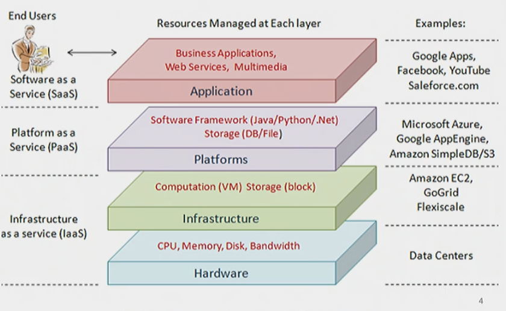
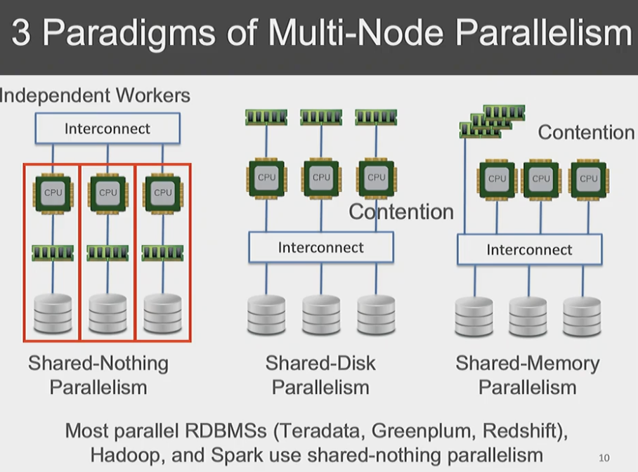

# Basics of Cloud Computing

The idea of cloud computing is essentially all the computation resource is stored remotely and you only need to rent the computation and handle the interface while all the backend things are covered

- Main pros of cloud vs on-premise clusters:
    - **Manageability**: Users don't have to worry
    - **Pay as you go**: You don't have to buy expensive hardware to do computation
    - **Elaticity**: Can dynamically add or reduce capacity based on actual workload's demand. (For example, if startup application gets very popular, can scale on cloud computing much easier, already infrastructure)

Three types of Cloud Computing
- Infrastructure as a service(Iaas), full control to the machine itself (Data Centers)
    - Compute: EC2 (Just like a virtual computer), ECS (has a lot of access to block chain containers), Fargate, Lambda
    - Storage: S3 , EBS, EFS, Glacier(Super Slow, Tape maybe)
    - Networking: CloudFront (Caches at different locations, local consumers, go to service closest to them), VPC (Like Local Internet)
- Platfomr-as-a-Service(PaaS), for developers (AmazonS3), given an API, retrieve api ONLY
    - Database/Analytics Systems: Redshift, TimeStream, DynamoDB(every element as a document)
    - Block Chain: No access/limited to block chain containers 
- Software-as-a-Service(SaaS), renting/giving out an application ot use such as turbotax
    - ML/AI: Transcribe, Translate, SageMaker ; (present API just call API)
    - Buisness Apps: Chime, WorkMail, WorkDocs

### Evolution of Cloud Infrastructure
- Data Center: Physical space from which a cloud is operated
- 3 generations of data centers/ clouds:
    - Cloud, network services, user rent services needed for data or software
    - Cloud 2.0: Virtualization of network of servers. For example, if working in a group, you can have multiple users and ssh to same machine with different operating machines, and then cannot operate on other people's spaces
    - Cloud 3.0: Just execute on server, without having to specify instant

CLoud 2.0 is faster Cloud 3.0 

### 3 Paradigms of Multi-Node Paralism
- Shared-Nothing Parallelism (Most Popular)
    - Different model of computers All the computers, connected the network(spark)
    - More independent

**CONTENTION** (DEADLOCK)
- Shared- Disk Parallelism: Shared Disk: Same clusters of disk
    - AWS S3: Only works for AWS, centralize all the disk
    - very hard to design systems that fits different types of hardware in one unified system

- Shared-Memory Parallelism: Share memory and disk
    - Most efficient but needs the most power and creates a lot of heating 
    - Less Scalable

Shared Disk Parallelism is largely enabled by the network, AWS essentially connects all disk with super high speed network

Decoupling of compute+memory from storage is common in cloud
- Hybrids of shared- disk parallelism + shared-nothing parallelism
- store datasets on S3 and read as needed to local EBS

ETL = Extract Transform LOad

### New Cloud Renting Paradims:
- On-Demand
    - Pay for compute capcity by the second or hour with no long-term commitments
- REserved
    - Significant discount compared to on demand, you tell AWS need later on
- Spot
    - Spare EC2 capcity for up to 90% off the ON-Demand price

Most resources are bundled together some applications might under utilize some resoruces. For example, one cpu may be running super hard while another being used as much (shared nothing parallelism) 

Cloud has higher resource effciency

**Car Anaolgy for Serverless Cloud:**

- Own a CAr (bare metal servers) own everying locally
- Rent a Car (VPS) what we do in pas, full control to the machine
- Car sharing (serverless)
    - code start issue

Serverless RDDMS:
- Now, instead of booting a machine and turning off a machine (creating instances and turning off instances), what you can do is recycle the machines if not used. However, this means this intial call will not be fast, all the calls afterwards will be.

**Disaggregation: Glimpse into the future**

Essentially, we are decoupling computation, memory and storage, and allowing all three to be used independently when needed

This allows for higher scalablility, adding more memory will not impact disk or cpu. 

Some main cons of cloud:
- Complexity of composing cloud APIs and licenses; data scientists must keep relearning: "CloudOps" teams
- Cost over time can crossover and make it constlier
- Easier to waste money accidentlly on the fly
- Lock-in by cloud ventro
- Privacy security and governance concerns 
- Internet disruption or unplanned downtime

**REVEIW**
- Three main layers?
    - IaaS, PaaS, SaaS
    - PAs use IaaS
- Separating PaaS from SaaS
    - SaaS is just ready to go, PaaS gives you more customization
- Shared disk parallelism vs. Shared Nothing Parallelism
    - Shared disk simplifies data management, giving all nodes access to same data, but contention for shared resources
- On Demand vs Spot Instances
    - On-Demand pricing is static but capacity to launch is not always available
- Benefits of Serverless Cloud
    - Scalability and cost efficiency – lower costs because it only uses resources you need
- Benefits of Resource disaggregation
    - Improved efficiency via resource utilization
- Cloud vs on-premise
    - Abstractified a lot for you, scalable and cost-effective on cloud, but latency due to data being processed off site and depends on internet to be used
    - High cost up front for on-premise
- 

