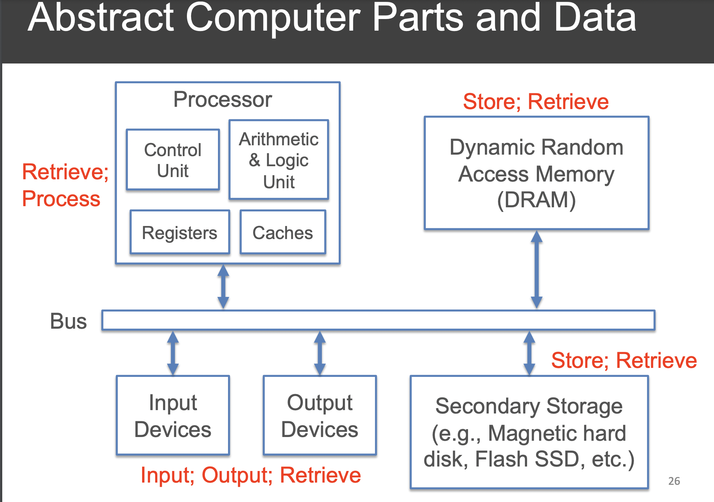

# Computer Baiscs

## Hardware
- Processor (CPU, GPU, etc.)
    - Hardware to orchestrate and execute instructions to manipulate data as specified by a program
- Main Memory (more expensive)
    - Hardware to store data and programs that allows for fast retrieval and location, byte level addressing scheme
- Disk (aka secondary/persistent storage) (less expensive)
    - Similar to memory, but slower and when turned off, will still be stored 
    - higher capacity / cost ratio; various addressing schemes
- Network interface controller (NIC)
    - Hardware to send data to / retrieve data over network of
interconnected computers/devices
- Bus
    - It is the mediator between all the components of the computer. 

## Software

### Terminology
- Instruction
    - Very Basic instructions understood by the hardware
    - Instruction Set Architecture (ISA)
    - bridge between hardware and software
- Program (aka code)
    - a collection of instructions used to execute hardware
- Programming Language
    - A human readable formal lanugage that writes programs, at much higher level than ISA
- Application Programming Interface
    - A set of functions so that other people can use in their own programs 
- Data
    - Digital representation of information, that is stored, processed, displayed, retrieved and sent by a program. 
### Different types of Software
- Firmware
    - Read only programs baked into the a device to offer basic hardware control functionalities, in non-volatile memory(memory that doesn't need power to be stored).
- Operating System
    - Collection of interelated programs that help as an intermediary platform/service to enable application software work more efficeintly/effectively
- Application Software
    - Software ran on the computer that aids the manipulation of data
    - Usually designed for human use

