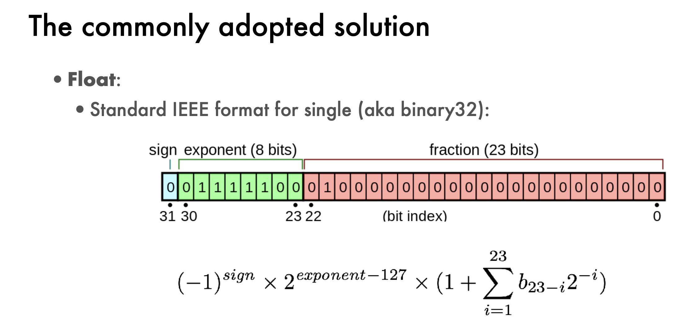

# Data Representation

## Digital Representation of Data
- Bits: 0 or 1
- Data type: Boolean, Byte, Integer, “floating point” number (Float), Character, and String
- Data structure: Array, Linked list, Tuple, Graph, etc.

## Encoding Byte Values

- Byte is 8 bits (can represent 0 - 255 in base 10)
- Hexadecimal (1-9: A- F)
    - Write in C with leading '0x', either case
**Conversion of ten base -> binary (asuming unsigned)** 
    - Lets say you have $348_{10}$ 
        - First, find how many bits you will need, so here you will need 9 bits ($log_2(348) = 8.4$ and ceil so 9)
        - $1 (\times 2^8)$ _ _ _ _ _ _ _ _ $= 256_{10}$
        - Now check you have left after 348 - 256 = 92
        - $1 0 1 0 1 1 1 0 0 = 348_{10}$
    - Other way around - if you have $1 0 1 0 1 1 1 0 0$:
        - $1 \times 2^8 +  0 \times 2^7 +  1 \times 2^6 +  0 \times 2^5 + 1\times 2^4 + 1 \times 2^3 + 1 \times 2^2 + 0 \times 2^1 + 0 \times 2^0 = 348_{10}$

    You can do the same in hexadecimal

Depending on your OS, you can have a 32 -bit representation or 64-bit representation of C data types

| Data Type | 32-bit ILP | 64-bit ILP |
|-----------|--------|--------|
| char      | 1 byte | 1 byte |
| short     | 2 bytes| 2 bytes|
| int       | 4 bytes| 4 bytes|
| long      | 4 bytes| 8 bytes|
| float     | 4 bytes| 4 bytes|
| double    | 8 bytes| 8 bytes|
|pointer    | 4 bytes| 8 bytes|

Usually, you use hexadecimal to show bits to be more concise for large bit size as one singular value in hexadecimal is 4 bits

**Signed Integer**
    

- $10 = 0 \quad (-16)\quad 1\quad (8)\quad 0\quad (4)\quad 1\quad(2)\quad 0\quad(1)\quad = 01010 = 8 + 2$

**Numeric Ranges**

- **Unsigned Values**
  - UMin = 0
    - 000...0
  - UMax = 2^w – 1
    - 111...1

- **Two’s Complement Values**
  - TMin = –2^w–1
    - 100...0
  - TMax = 2^w–1 – 1
    - 011...1
  - Minus 1
    - 111...1

**Float Representation**

     
- Max: 0 11111110 11111111111111111111111 
- infinity: 0 11111111 00000000000000000000000
- negative infinity: 1 11111111 00000000000000000000000  
- NAN : 0 11111111 100000000000000000000000
can you watch over my stuff while i go to the bathroom

- Why do computers use binary digits?
    -To represent data (high and low voltage is stored represented as 1 and 0)
- How many integers can you represent with 5 bits?
    - $2^5 - 1$
- How many bits do you need to represent 5 integers?
    - 3 bits
- What is the hexadecimal for $20_{10}$?
    - $14_{16}$
- Why do we need a float standard?
    - To represent small and large numbers using bits. 
- Why should a data scientist know about float formats?
    - floating can affect accuracy
- What does “lower precision” mean for a float weight in DL?
    - This means that you are using float32 instead of float 64, this will have faster computation and uses less memory but you will lose some accuracy 
- Why is serialization needed?
    - Serialization is a way to transmit data into a network by converting to string or bits. Often times, computers use different operating systems so in doing so, you are allowed to serialize and deserialize. 

