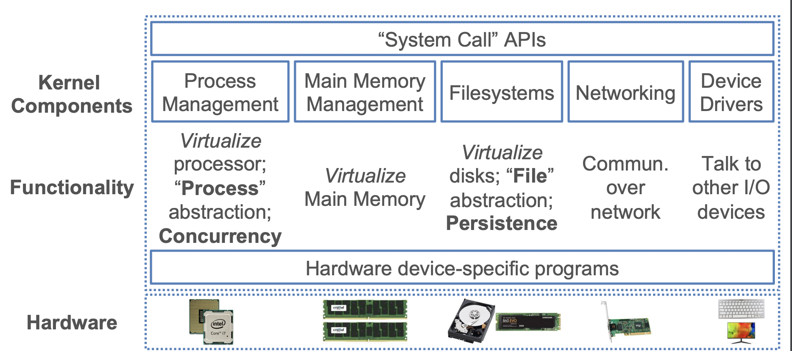
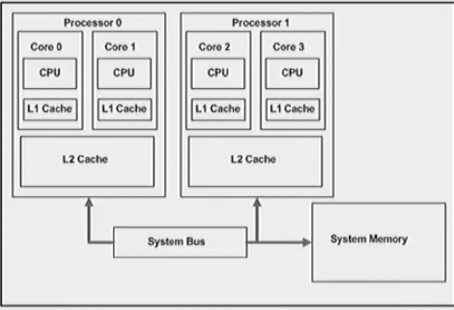
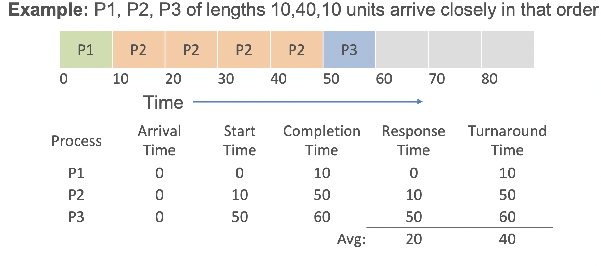
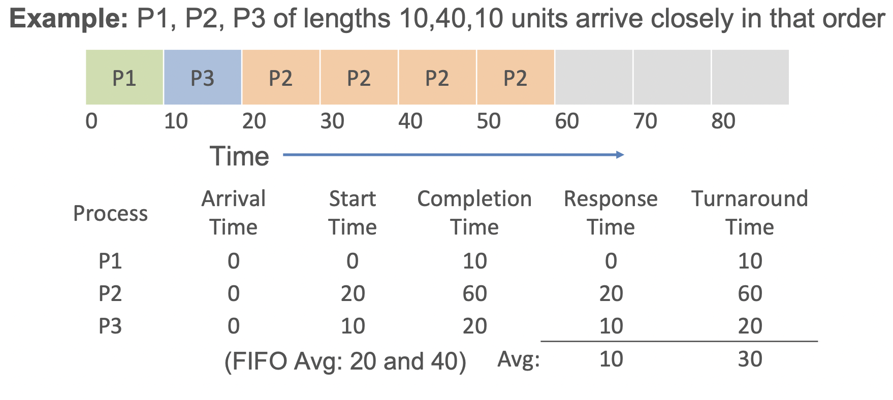
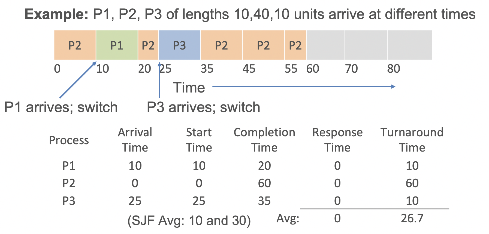
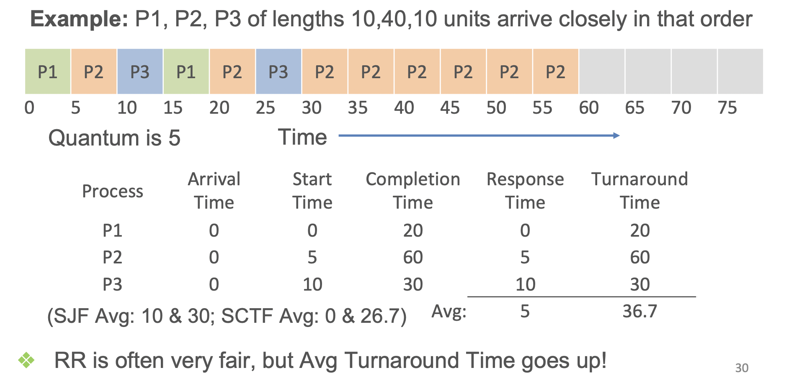

# Operating Systems

**Main Def** Interface between Hardware and software application. 

- Kernel is a computer program that manages essiently everything in the OS. Kernel have modules that abstract parts of the hardware.

- Auxillary Components such as terminal and file finder are additional parts of the OS that shell/terminal, file browser for usability, extra programs installed by I/O devices, etc.

- Process: A running program, the central abstraction of the OS

**Note** It is probably good to know about the ideas behind processes in OS as a way to know how data is queried and processed when doing computations on data.

Essentially the OS steps are:
1. Create a ProcessID
2. Assign part of the process to the DRAM (Address Space)
3. Load code and data to the dram (if applicable)
4. set inputs needed to run the program
5. Start the process and schedule
6. Once its running, hand it off to other places
7. Kill the process or the process finishes after its done (processID)

## Concurrency

- Computers have multiple processors with multiple cores.

- Each core have their individual caches and each processor caches that the cores can use
-  

A computer program can have multiple processes. the problem is each process does not share the same memory space so to communicate between two processes.  Switching from one process to another requires some amount of time (relatively speaking) for saving and loading registers, memory maps, and other resources

**Overhead** is the time it takes for the OS to manage Input - Output

A thread is the unit of execution within a process. Some people call threads lightweight processes because they have their own stack but can access shared data. Since threads share the same address space as the process and other threads within the process, it is easy to communicate between the threads. The disadvantage is that one malfunctioning thread in a process can impact the viability of the process itself.

In a single processor, there can never be two processes running at the same time. Therefore, a process has a scheduling algorithm to make virtually seem like it is running at the same time. This is called concurrency. Parrelism can happen when there are multiple processes such as cpu's. 

The terms “parallelism” (denoting genuine simultaneous execution) and “concurrency” (indicating the interleaving of processes over time to simulate simultaneous execution) distinguish between the two modes of operation, whether truly simultaneous or approximated.

- Problem with multithreading:
    - It is very easy to get something wrong
    - It takes forever to debug the program

- Scheduling for multiprocessing/multicore is more complex
- Load Balancing: Ensuring different cores/proc. are kept roughly equally busy, i.e., reduce idle times
- Multi-queue multiprocessor scheduling (MQMS) is common
- Each proc./core has its own job queue
- OS moves jobs across queues based on load
- Example Gantt chart for MQMS:

Now of days, there is a thing called data intensive programming, where we are doing simple operations but a lot of data, and not computationially intensive programming. Computionally intensive programming requires multithreading while data intensive may not. You can use multiple machines 

## Objects oriented Programming

How do we represent objects in memory?
- Pointers (i.e., memory addresses).
- DRAM => Dynamic Random Access Memory, Disk & network are sequential.

## Processes Management of OS (Scheduling)

For each processor, the os handels what processes to compute. As such, the OS needs a scheduling Policies. 

**Nomenclature**
- Arrival Time: Time when processes is created 
- Job Length: How long it took for the process to complete (doesn't consider arrival time to start time)
- Start time: Time whe process starts
- Completion time: time when process ends
- Turnaround time: Completition time - arrival time (essentially how long was the process in the scheudling policy)
- Response Time: Startime - arrival time  (time from when process was created to process start)
- Workload: Set of processes, arrival times, and job lengths that
OS Scheduler has to handle

In general, not all Arrival Times and Job Lengths will be known beforehand. But preemption is possible.

**Key Principle: Inherent tension in scheduling between overall workload performance and allocation fairness**

### Scheduling Policies/Algorithms

1. Fifo (First in First Out)

- 
- Cons: Short jobs may wait a lot (convoy effect)

2. SJF (Shortest Job First)

- 
- Cons: Don't know job time, it is also unfair. continous jobs come in as a stream. The very large task will not be executed

3. SCTF (Shortest Completion Time First)
- Jobs might not arrive at the same time. Need Preemption
-  
- Cons arethe same as SJF

4. Round Robin
- Fixed time *quantam* given for each Job; cycle through job
-  

## Review Questions

- If you can afford infinite DRAM, is there any reason not to use it?
    - Energy, you need infinite amount power, past 10 years, battery technology not that great (hasn't changed)
    - Heating, introduce infinite amount cooling system
    - Communication speed, Infinite memory, but the bus is super slow, you cannot write that much(assuming we get infintie dram, we must change the hardware as well as the software)
    - Diminished Return, (memory heiarchy, we can achieve similar as infinite amount of DRAM)
- What is the purpose of an OS?
    - We want to bridge the gap between hardware and software
    - Process management
    - Memory Management
- Why is the design of an OS so modular?
    - For security, so that when something goes wrong, everything else can still run
    - Simplify the complexity, makes it much easier to maintain the software, imagine you update one program and breaks other(don't want that!!!)
    - 
- Why does an OS need to use a scheduling policy?
- Which quantity captures latency of a process starting: Response
Time or Turnaround Time?
- What gives rise to different scheduling policies?
- Which scheduling policy is the fairest among the ones we
covered?
- What is the Convoy Effect? Which sched. policy has that issue?
- Explain one pro and one con of Round Robin over SJF.

## Abstractions: File and Directory

**A file is a persistant sequence of bytes that coherently represent a digital object for an application**

### What is file and directory
persistant (file format) - many different types of file format, largely depends on different application (all binarry data, different application how to interpret)

meta data = usually at very beginning to show how to interpret a file

pay load = file content

directory - a cataloging structure to store files with list of references to files and other directories.

Should files should be stored contigously?

So files should not be stored contigously because if you delete a file, then that space where the file was deleted may not be able to used as other files may be to big to store in the deleted space.

However, when files are stored contigously, it is much easier to read, so perhaps for files that you know you do not want to delete, like core functionality code of the os, you can probably store contigously. 

file and directory of os allows for abstractaiton (a way for humans to interact with binary data)

os also moves the physical bytes from disk to memory

THE MORE CAPABLE, THE LESS COMPATIBABLE BETWEEN FILE SYSTEMS

- Dozens of filesystems exist, e.g., ext2, ext3, NTFS, etc.
- Differ on how they layer file and dir. abstractions as bytes,
what metadata is stored, etc.
- Differ on how data integrity/reliability is assured, support for
editing/resizing, compression/encryption, etc.
- Some can work with (“mounted” by) multiple OSs

FAT32 - only 4 gib of memory space due to the address only have 32 bits

**File Descripter**: Essentially a pointer to the beginning of the file on disk to instruct the hardware to move to that specific location and read the beginning meta data to find how large the file is and jump to the end of the file

- open(): Create a file; assign fd; optionally overwrite
- read(): Copy file’s bytes on disk to in-mem. buffer; sized
- write(): Copy bytes from in-mem. buffer to file on disk
- fsync(): “Flush” (force write) “dirty” data to disk
- close(): Free up the fd and other OS state info on it
- lseek(): Position offset in file’s fd (for random R/W later)
- Dozens more (rename, mkdir, chmod, etc.)

### Difference between database and files
- A databatsean orgnaized collection of interrelated data

-  Data Model: An abstraction model to define organized in a formal mathematically precise way.

- Every database is just an abstraction on top of data files

- All data systems are application/platform software that use OS System call API for handling data files.

### Principles and Classical Ideas

- Old ideas are still relevant today
    - Most of the ideas are not new

- Hierarchal Model

- Network Model

Relational Model
- decoupled in a few relationships
- we have supplier, supply, part

Binary Representation Lowet level

Treat Data as an object in Highest level

what about storing on disk?

CSV store is double storing data on disk

- Structured Data: A form of data with regular substructure
    - Relation
    - store

Formating comes from the files, not the operating system or file systems

Binary Format: things such as pdf that need supporting applications to make human readable
Text Format: in string fromat already when open

One big thing about binary format is sending data somewhere is more packaged

Different RDBMS 
- Row -Oriented
    - Biggest advantage is if you wanna query and look for values of every row
    - If machines store by row, doing aggregation stuff will take a long time cause you will have to look at every machine, whichi s slow
- Columnar
    - Biggest advantage, for aggregations, you only have to take specific machines
    - If you want to look at rows of columns, it will be hard to look at.

CSV is most readable among all machines

- Ordering: Matrix and Dataframe and row/column have ordering while relations don't 
- Schema Flexibility: Matrixes have to be numbers, dataframes cna have any types while and have no defined schema, relations have tuples for all schemas
- Transposability: Matrix and dataframe but not need

- Semi- STructured Data
    - doesn't follow the tabular structure associated with relational databases or other forms of data tables. However, it does contain tags and metadata to separate semantic elements and establish hierarchies of records and fields.
    - SUCh as JSON
- Data Lakes
    - Essentially Just a drawer of miscellaneous data stored on disk (very loose coupling)
    - Data usually stored in JSON, migration (I am guessing how the files are stored or where the files are stored)
    - Databricks and snowflakes sell a service where you just pump your data on disk and the companies will handle the shit for you

**Pros**

- Data Lakes use a file format called Parquet, which stores compressed from, can be much smaller than CSV/ JSON
- Parquet is stored in columns so aggregation methods are better
- schema on file: rich meta data, stats inside format itself
- can store complex types in a column
- Data scan(because storage is less, you don't have to look into all storage)

**COns**

- Human Readability
- Mutability: Parquet is immutable so there are no edits to it, must make copies
- Decompression/Deserialization overhead (takes more time)
- Adoption in Practce, CSV?JSON support more pervasive

**Data as File: Other Common Formats**
- Machine Perception data layer on tensors and/or time-series
- Myriad binrary formats, typically with lossy compression, e.g., WAV for audio, MP4 for video
- CSV Files are easier to deal with, large scale systems must optomize

## Main Memory Management
**Page:** Is some abstraction from DRAM as a specified chunk that we can work with to manage memory

**Page Frame**: Virtual slot in DRAM to hold a page's content

OS essentially dictates how much storage each page is (page size)

Technically, Block is for Disk, Page is for memory but people use them interchangably

OS has indexes for all the address spaces of pages, to dictate how to replace each page

**Memory Leaks**: Idea on OS sometimes may stop keeping track of an address sace and wastes pages of dram ,slowing the computer down

- Most High level languages have Garbage collection in which the languages can auto-reclaimcsome wasted memory
- Low level has memory leak nightmare but more efficient
Systems can detect memory leak if no variables are using this address space, but this peace of a page/pages is not being used

### Storing Data in Memory

- Data Structure Overlays: When a data structure (such as an array, a linked list, or a tree) is overlaid on pages, it means that the elements of this data structure are distributed across multiple memory pages rather than being contiguous in physical memory.

Page Faults and Paging: In a virtual memory system, not all pages of a data structure need to be loaded into physical memory (RAM) at the same time. Instead, pages are loaded into memory on demand. When a program accesses a memory location that is not currently in physical memory but is mapped in the virtual address space, a page fault occurs. The operating system then loads the required page from disk into a free page frame in physical memory.

**Apache Arrow**: Emerging standard for columnar in memory data layout, working with an interface(dask, spark) with different file formats(parquet)

- Persistance Data: Program state/data is available intact even after process finishes such as HDD

- Volatile Memory: A data storage dvice that needs power/electricityto store 

- There is such thing as perstant Memory which means RAM that is backed by by battery power so it can keep on running (Netflix)

### Disks (Secondary Storage)
- Data retrival and storage is don on disk blocks
- Unlike RAM, retriving/storing data at different places take up different amounts of time
    - so a key idea is we want to optomize data retriviel disk blocks (4kb - 8kb)
    - However disk block can be x times the size of OS/RAM page
- File date allocated in increments of disk pages

**Key Princile:** Sequential vs Random Access
- Accessing RAM location on memory is 0(1)
- However, it is different on disk, ideally, you would like to store related data in a specific sequetial order as it will be much faster to read

### Flash Storage
Memory technology to build hardrive disk. SSD
- data access latency
- Data transfer throuput
- Parallel read.writes more feasable
- much lower lifetime

### Non- Volantile RAM
More like memory byte level addressability. Latency is very fast (no wide deployment)

### REVIEW

- Database vs File?
    - Databases are structured – abstractions that organize data in a certain way
- Two levels of a database?
    - Logical – what data is stored and the relationships
    - Physical – how it’s physically stored – indexing, access
    - Separation needed to provide abstraction
- Data modality for JSONs?
    - Graphs
- Two differences between relations and DataFrames
    - Dataframes have ordering, relations don’t. Dataframes are transposable, relation is not.
    - Relation as a dataframe? Vice versa?
    - Yes, no – relation is just a df without ordering to my understanding
- Can you store a tensor as a relation? Vice versa?
    - No, yes, similar
- Address space of a process? Memory leak?
    - Address space is the range of memory addresses a process can use
    - Memory leak – process allocates memory but fails to release it back
- Parquet
    - Columnar storage file format optimized for use with Apache
    - Faster data compression
    - Loading in of just certain columns
    - Richer metadata
- Arrow vs Parquet?
    - Arrow is Apache, in-memory data format optimized for analytical operations
    - Designed for in-memory data processing, parquet optimized for storage
    - For memory, not disk
- Which storage device has random-sequential access dichotomy?
    - HDDs – hard disk drives due to mechanical movement of read/write head

