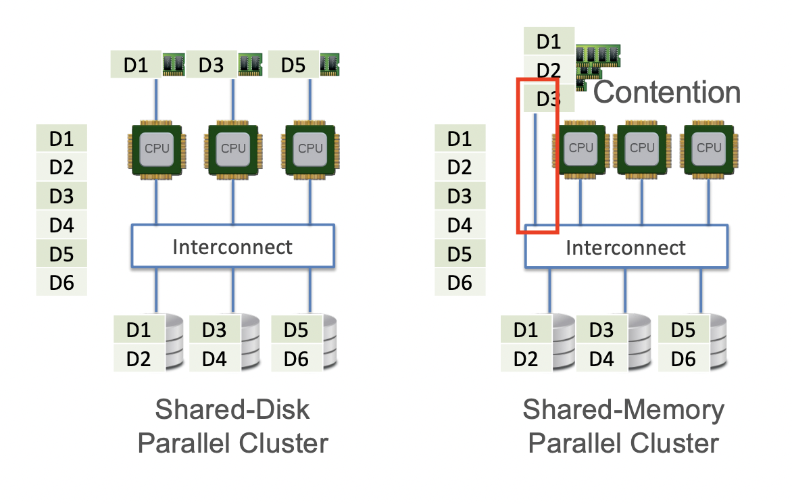

# Parallelism Basics

**Unreasonable Effectiness of Data**

The more data you have, the accuracy is likely to be higher, try to get high quality data. 

Bias-Variance Tradeoff of ML:

- High Bias: Roughly, model is not rich enough to represetn data
- High Variance: Model overfits to given data; poor generalization

MORE DATA MORE DATA MORE DATA MORE DATA

BIG DATA 3 Vs:
- Volume Larger than single-node DRAM
- Variety: Relations, docs, tweets, multimedia
- Velocity: High generation rate, e.g. sensors, survelliance

**MAIN IDEA:** Split up workload across processors and herhaps also across machines/workers

## Threads (Generalization of process abstraction from OS)
- Common in parallel data processing, but remember THREADS RUN CONCURRENTLY
- All threads share address space

- multi-core CPUs, a thread uses up 1 core
    - hyper-threading: virtualizes a core to run 2 threads (as a way for visualization) - slow down actual computation but decrease response time (visual response) so 6 total  i/o cost is 6 (4 input and 2 i/o)

- Dataflow graph
    - directed graph representation of a program with verticies being abstract operations from a restricted set of computational primitives.
    - like relational algebra graph (tells us the priorization of which nodes need to be computed first and which ones that can be differed)

- Task Graph
    - all node task

Difference between dataflow graph and task graph is the fact that task graph uses the nodes as task, and the edges are operators while dataflow is the opposte

## Parallel Data Processing

**Topological Sort** of tasks in task graph for scheduling to allocate which workers do what tasks to figure out the most efficient way to run the tasks

Main Pros of task parallelism:

- Simple to understand; easy to implement
- independence of owkrers => low software complexity

Main Cons of task parallelism:

- Data replication across nodes; wastes memory/storage
- idle times possible on workers
 

Idle times are dictated by the toplogy of your task graph

## Dask

- APIs for large scale data science computation
- Dynamic Task Schedulers on multi-cores/multi-nodes
- Data chunks should be 3x - 10x the amount of cores
- However, data chunck size x cores should be less than dram
- chunk size should not be too small

Single Instruction Multiple Data (SIMD):
Essentially when multiple processors handle the same task on different chuncks of data. 

FLOPS: FLoating Point Operations Per Second

**Amdahl's Law** Formula for upper bound speed up, Hard to get linear speed up

- Briefly explain 3 benefits of large-scale data in Data Science.
    - Study of granular phenomena not previously possible
    - New applications and personalization / customization
    - Enables more complex ML prediction targets and mitigates variance
- What is a dataflow graph? Give an example from a data system.
    - Abstractified data flow, where each node represents an operation, and edges represent data dependencies
- How does a task graph differ from a dataflow graph?
    - Opposite of Data flow, task graph nodes are data dependencies and edges are operations
- Briefly explain 1 pro and 1 con of task parallelism.
    - Faster speed up
    - Can lead to synchronization issues
- Briefly explain 1 scalability bottleneck that Dask still faces.
    - Huge task graphs could take too long to serialize or communicate, making parallelism less efficient
- What is the degree of parallelism of a task graph?
    - Max number of tasks executed concurrently
- What is speedup? How is it different from scaleup?
    - Speedup – Measures the performance improvement of a system when the same problem is solved with more nodes
    - Scaleup – measures how well a program handles larger problems 
- Is linear speedup always possible with task parallelism?
    - no 
- What is SIMD? Why is “vectorized” data processing critical?
    - Same Instruction, multiple data
- What is the point of Amdahl’s Law?
    - to find the upperbound of speed up
- Briefly 1 pro and 1 con of TPU vs. GPU.
    - GPU cheaper but less specialized in DL
    - TPU a lot of heat and expensive, but more specialized in DL

## Scalable Data Access
- Page Access; I/O Costs; Layouts/Access Patterns
- Scaling Data Science Operations

### Page Data Access to Dram

- Basic Idea of Paged Data Access to DRAM Essentially Split Data file and stage reads of its pages from disk to DRAM (vice versa too)

Between the Disk and DRAM, there is latency of how fast the pass of information is:

#### latency
- **Disk I/O Cost:** Abstract counting of number of pages I/Os; can map to bytes given page size (how fast Disk with I/O through put of 800 MB/s -> meaning that it will take 50 s to transfre 40 GB of data)

- **Communication/Network I/O Cost:** Abstracting counting of number of Pages sent or recieved over network ( Network with speed: 200 MB/s -> 40GB/200MBps = 200s)

#### Scaling to (Local) Disk
- Cache Replacement: A way to evict pages in Dram from disk. Usually you would use the last touched page. 
    - For example if you had 4 frames in DRAM that were empty and 6 pages are scanned, there will need to be two pages to be repaces
- Usually, Disk are read in blocks at a time, meaning a bunch of pages at once to transfer to DRAM

-**Data Layout** Order in which data is laid out on storage; property of phsyical level of database

-**Data Access Patter**: Order in which a program needs to access dat for its computtions; property of the program

-**Key Principle:** Opotomizing data layout on disk based on data access pattern can help reduce I/O costs and latency. 

#### Row Store and Column Store
- Row store essentially stores data by row in databases/hdds. 
- Column store stores data by column in databases/hdds
- Hybrid/Itled/Blocked store stores by chuncks of a dataframe such as a 2x2 grid

The implication in i/o cost is that reading pages is easier depending what task is at hand 

**EX:** Dask dataframe splits different chuncks by in row stored data into pandas dataframes. If the file to large for DRAM, there are repartitions to split the file even smaller. 

#### Scaling with Remote Reads
- Sorta the same as remote reads but over the network
- However, it is more restrictive than scaling with local disk, since spilling is not possible ro requires costly network I/Os

#### ML Systems

- Matrix Sums/ Norms
    - i/o cost same as dataframe
- BGD vs SGD
    -  Almost always use SGD 

#### Questions
1. What are the 4 main regimes of scalable data access?
2. Briefly explain 1 pro and 1 con of scaling with local disk vs. scaling with remote reads.
    - Scaling with Local Disk: 
        - Pro: A lot faster, less latency
        - Con: Probably can't store as much data
    - Scaling with Remote Reads
        - Pro: Store a lot more data
        - Con: More latency
3. You are given a DataFrame serialized as a 100 GB Parquet columnar file. It has 20 columns, all of the same fixed-length data type. You compute a sum over 4 columns. What is the I/O cost (in GB)?
    - 20 GB
4. Which is the most flexible data layout format for 2-D structured data?
    - Hybrid/Tile
5. You lay out a 1 TB matrix in tile format with a shape 2000x500. What is the I/O cost (in GB) of computing its full matrix sum?
    - 1 TB
6. Briefly explain 1 pro and 1 con of SGD vs. BGD.
    - SGD:
        - Pro: Works for non-convex functions, and less computing time and reads less pages
        - Con: Less accurate, probably have to do more iterations of GD
    - BGD:
        - Pro: Always the most accurate gradient for each epoch
        - Con: Each Update of w needs full scan: costly I/Os
7. Suppose you use scalable SGD to train a DL model. The dataset has 100 million examples. Mini-batch size is set to 50. How many iterations (number of model update steps) will SGD finish in 20 epochs?
    - 40,000,000
8. What is the precise runtime tradeoff involved in shuffle-once-upfront vs. shuffle-every-epoch for SGD?
    - n-1 amount of more shuffle cost, n being the amount of epochs

## Data Parallelism
- **Data Parallelism:** Partition large data file physically acroos nodes/workers; within owkreker: DRAM-based or disk-based

    - The most common approach to marrying parallelism and scalability in data systems
    - Generalization of SIMD and SPMD idea from parallel processors to large-scale data and multi-worker/multi-node setting
    - Distributed-memory vs. Distributed-disk

Data parallelism is techincally orthogonal to the 3 paradigms (shared-nothing, shared-disk parallelism, shared-memory parallelism)

#### Shared nothing data parallelism

- Partitioning a data file across nodes is aka sharding
- Part of the stage in data processing workflows called ETL (Extract-Transform_Load)
- ETL is an umbrella term for all kinds of processing done to the data file before it is ready for users to query, analyze, etc. 

    - sharding, compression, file format conversions, etc
- Most common way to partition is to partitoion row-wise/horizontally (sharding)

- **3 common schemas (given k nodes):**
    - Round- Robin: assign tuple to node i MOD k
    - Hasing_based: store things by a hash key (so need a hash partitioning attribute)
    - Range-based: Store by some sort of ordinal partition

- Tradeoffs
    - hasing-based most common in practice for RA/SQL
    - Range-based often good for range predicates in RA/SQL
    - But all 3 are often OK for many ML workloads (doesn't matter which one usually the storing of arbiturary data in arbituary data doesn't effect ML)
- Replication (making multiple copies) of partiton across nodes is common to enable fault tolerance and better parallel runtime performance

- Fault tolerance is a process that enables an operating system to respond to a failure in hardware or software

There is also columnar and hybrid/tiled partitioning

#### cluster Architectures
- Manager-Worker Architecture
    - 1 (or few) special node called Manager; 1 or more Workers
    - Manager tells workers what to do and when to talk to other nodes
    - Most common in data systems (e.g., Dask, Spark, par. RDBMS (Relational Database Management System
), etc.)
- Peer-to-Peer Architecture
    - No special manager
    - workers talk to each other directly
    - E.g., Horovd
    - Aka Decentralized (vs Centralized)

**Bulk Synchronous Parallelism (BSP)**
- Most common protocol of data parallelism in data systems (e.g., in parallel RDBMSs, Hadoop Spark)
    - Shared-nothing sharing + manager-worker architecture
    1. Shared data file on workers
    2. Client gives program to manager (SQL query, ML training, etc.)
    3. Manager divides first piece of owrk among workers
    4. Workers work *indpendently* on self's data partition (cross-talk can happen if manager asks)
    5. Worker sends partial results to Manager after one
    6. Manager waits till all k done (there our communication costs)
    7. Go to step 3 for next piece

**Speedup**
- Cluster overhead factors that hurt speedup:
    - Per-worker: startup cost; tear-down cost
    - On Manager: dividing up the work; collecting/unifying partial results from workers
    - Communication costs: talk between manager-worker and across workers (when asked by manager)
    - Barrier synchornization suffers from "stragglers" due to skews in shard sizes and/or worker capacities

**Distributed filesyste (DFS)** is a a cluster resident filesystem to manage distributed files (basically saying that amazon stores your files on different machines but to you the developer, it seems like all on one system)
- A layer of abstraction on top of local filesystems
- Nodes manage local data as if they are locla files
- Illusion of a one global file: DFS APIs let nodes access data sitting on other nodes
- 2 main variants: Remote DFS vs In-Situ DFS
    - Remote DFS: Files reside elsewhere and read/written on demand by workers (trying to write content to the server directly)
    - In-Situ DFS: Files resides on cluster where workers exist ( )

**Network Filesystem (NFS)**
- An old remote DFS with simple client-server archiecture for replicating files over the network
- Like dropbox, essentially, every device maintains a copy of the file and everytime you update the file, dropbox will maintain the latest version of the file
- Issue with this system if high contention for concurrent reads/writes
- All users can understand, super simple
- Not scalealbe(not space efficeint )
- single point of failure, server down, everyone is fucked

**Hadoop DFS**
- Most popular in-situ DFS; part of Hadoop; open source spinoff of Google File system
- Basically, 
    - split two pieces, namenode and the meta data

splitting files into multiple pieces, putting in different  so that when you change a specific part of the file, you don't have to update the entire file for changes but that one specific piece

Task Parallelism is essentially just different operations performedo n the same or different data

Data parallelism is same operations performed on different subsets of the same data

Stateless, and unstateless 

#### Review Questions
1. To which multi-node parallelism paradigmn(shared nothing/memory/disk) does data parallelism apply?
    - All three are data parallelism paradigm
2. What are the two most common types of cluster communication protocols in parallel data systems?
    - Manager --> Workers 
    - peer to peer
3. Is it possible to combine columnar partitioning with row store? Vice versa?
    - Yes Hybrid Apporach
4. What exactly is the “synchrony” in BSP?
    - When manager divides the work, subset of data is for each nodes the indpendent part, then wait for all the workers
5. Name 2 common sources of overhead in data-parallel systems that can lead to sub-linear speedups.
     - Per-worker: startup cost; tear-down cost
    - On Manager: dividing up the work; collecting/unifying partial results from workers
    - Communication costs: talk between manager-worker and across workers (when asked by manager)
    - Barrier synchornization suffers from "stragglers" due to skews in shard sizes and/or worker capacities
6. Name 2 SQL aggregates that are NOT algebraic.
    - 
7. Why is SGD not amenable to parallelization like algebraic aggregates?
8. Why does Parameter Server have high communication costs when executing
data-parallel SGD on a cluster?
9. Briefly explain 2 systems-level optimizations in data-parallel systems and how
they can benefit data science workloads.
10. Name 1 pro and 1 con of BSP over task parallelism. Why do most parallel data systems today employ only one or the other?
- Pro:Simplicity in Synchronization: BSP provides a structured approach to synchronization, where computation phases are followed by communication phases, and then a global synchronization barrier. This clear separation makes it easier to reason about the state of the program and to debug synchronization issues, as all tasks synchronize at well-defined points.
- Con: Potential for Inefficiency Due to Synchronization Overhead: The global synchronization barriers in BSP can lead to inefficiencies, especially if tasks have uneven workloads. If some tasks finish their computation phase much earlier than others, they must wait idly for the slowest task to reach the synchronization point, resulting in idle time and reduced overall efficiency.
